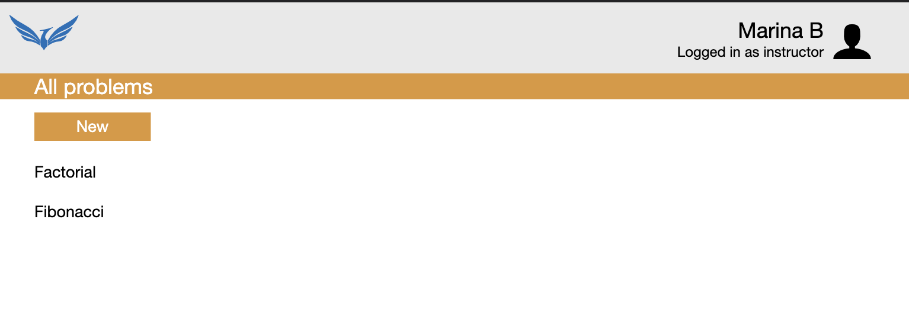
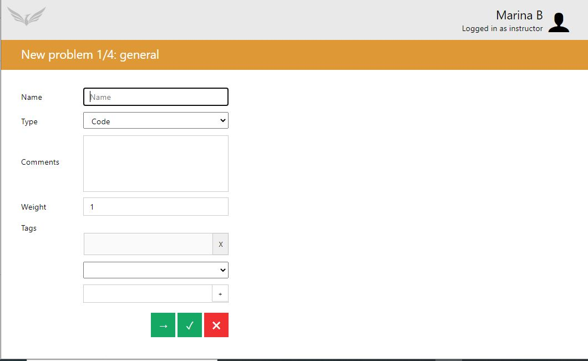
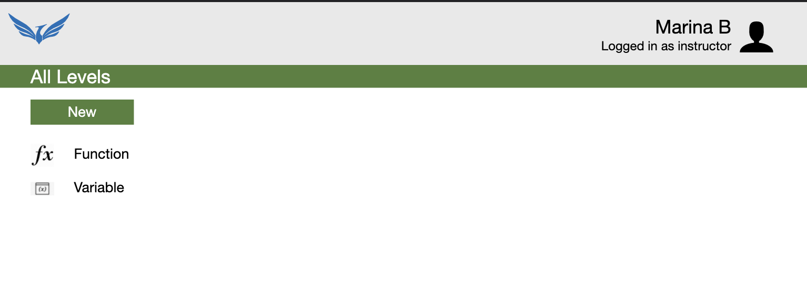
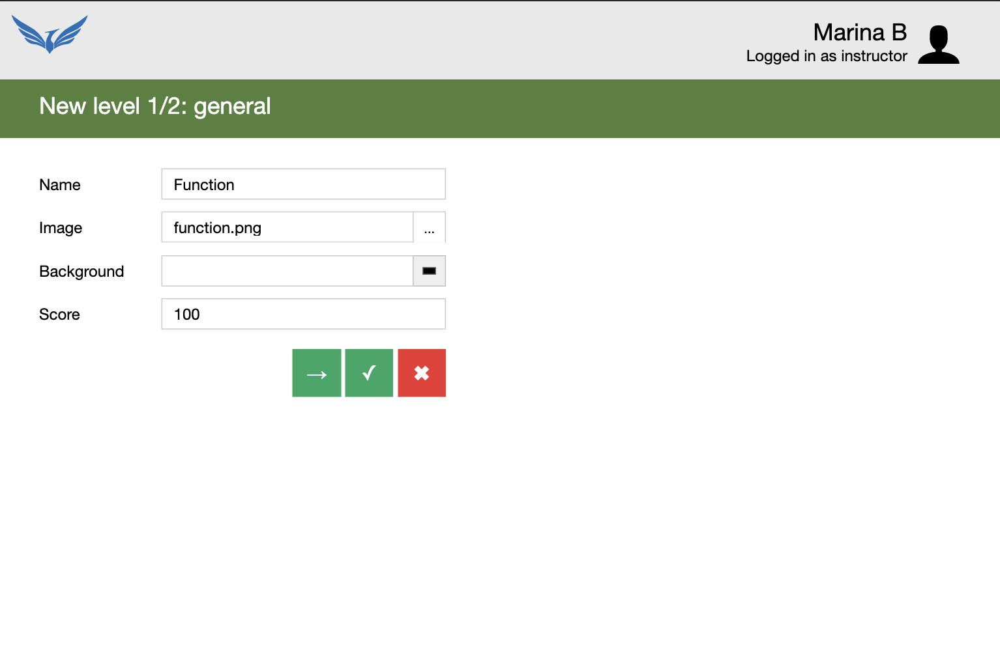
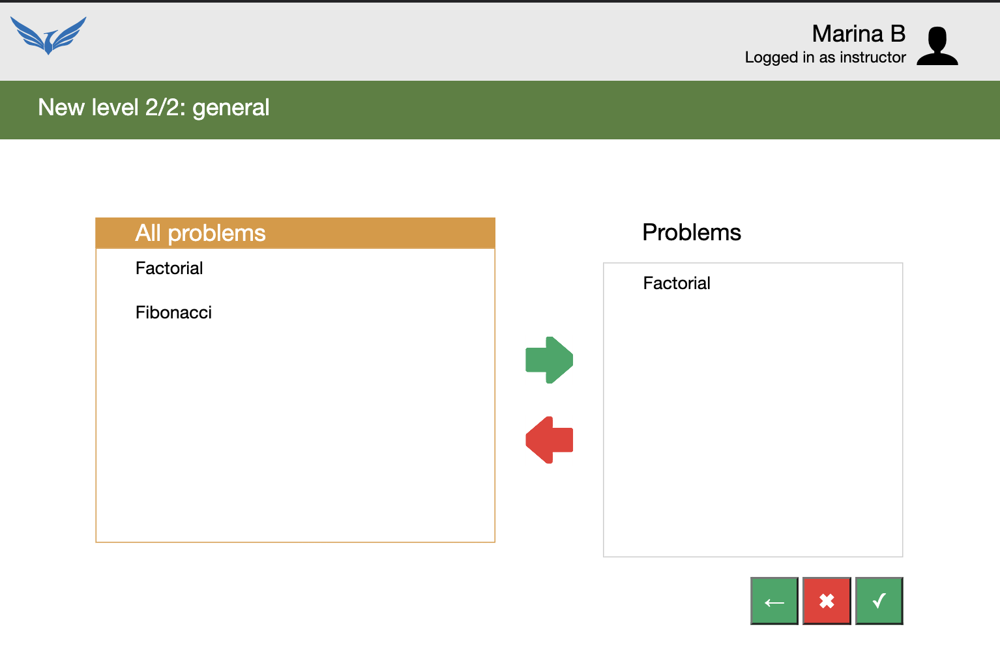
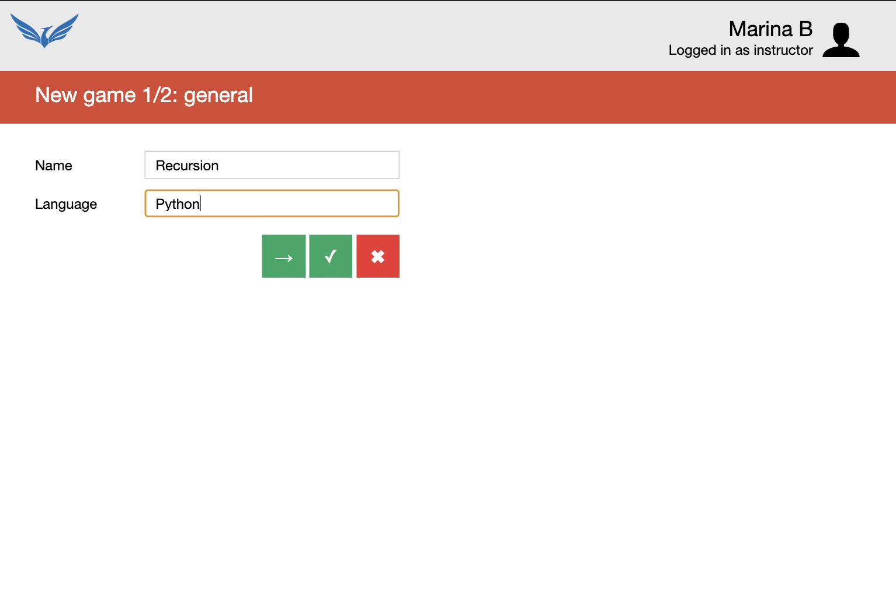
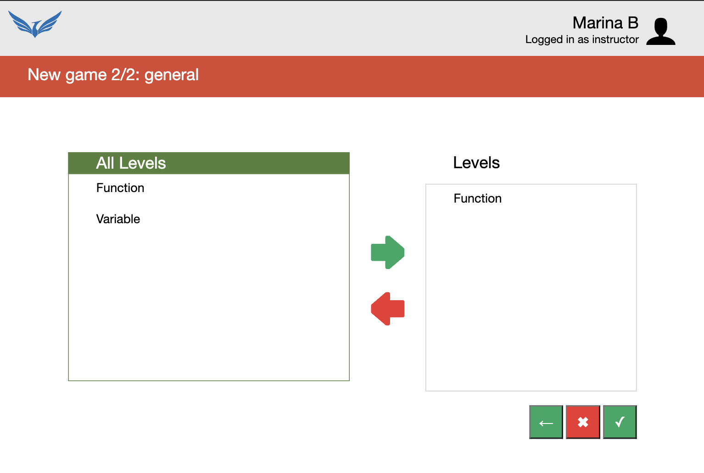

# Virtual Lab

    An application to help intro to CS students learn programming in a fun way.

<h2>Instructor View</h2>

 

 

    Instructors can create, edit or delete a problem. When instructors create a problem, they can mention how much weight this particular problem carries along with instruction for students, a starter code (if any) and test cases.

 

 

 

 

    After they have created a problem, they can create a level where they can place certain problems to include in this particular level. 

 

 

 

    After they have created a level, they can create a game where they can place certain levels to include in this particular game. 

<h2>Student View</h2>

## Tech Stack
<ul>
    <li>HTML</li>
    <li>CSS</li>
    <li>JS</li>
    <li>Flask</li>
    <li>SQLite</li>
   
</ul>

